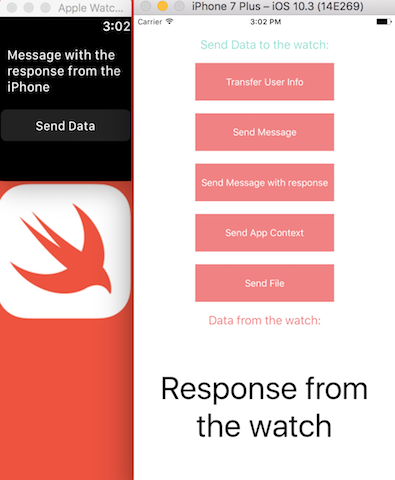

# Let's make communications between iPhone and Apple Watch apps.
Code examples to make communications between iPhone and Apple Watch apps.

Uses the Watch Connectivity framework to communicate between your iOS app and Watch app.

<h3 align="center">

</h3>

## Compatibility

This project is written in Swift 3.1 and Xcode 8.3.2.

## Available on
iPhone 9.3+ , Apple Watch

## Tools
1. Storyboards, Auto Layout  
2. Frameworks - Foundation, UIKit, WatchKit, WatchConnectivity
3. SwiftLint

## Author

* [Konstantin Khokhlov](https://ru.linkedin.com/in/const)

## License

Copyright 2017 Konstantin Khokhlov.

Licensed under MIT License: https://opensource.org/licenses/MIT
